<!--
  Meta Description: Startup Funds IRR - An analysis of Internal Rate of Return (IRR) and performance metrics for top-tier venture capital funds (Thrive Capital, Union Square Ventures, Founders Fund, Benchmark, a16z) and startup accelerators (Y Combinator, Techstars, 500 Global).
  Keywords: IRR, internal rate of return, venture capital, VC funds, startup accelerators, fund performance, net IRR, TVPI, DPI, Thrive Capital, Union Square Ventures, Founders Fund, Benchmark, a16z, Y Combinator, Techstars, 500 Global, vintage year, startup investing
-->

  

 

<h1 align="center">🚀 Startup-Funds-IRR</h1>

  <strong>Top Venture Capital Funds & Startup Accelerators Performance Guide</strong> 
  <em>Internal Rate of Return (IRR) Analysis & Benchmarking</em>

  An in-depth analysis of <strong>Internal Rate of Return (IRR)</strong> and performance metrics for top-tier <strong>venture capital funds</strong> and <strong>startup accelerators</strong>, utilizing public pension disclosures and leaked performance data. This repository serves as a comprehensive guide to understanding <strong>VC fund performance</strong>, <strong>accelerator returns</strong>, and key investment metrics used in the private capital markets. 💰

---

## 📋 Table of Contents

- [Venture Capital Funds Performance](#venture-capital-funds-performance)
- [Accelerator Programs Performance](#accelerator-programs-performance)
- [Key Metrics Explained](#key-metrics-explained)
- [Contributing](#contributing)

---

## 🏦 Venture Capital Funds Performance

Top-tier venture funds typically target a **Net IRR** of **20%–30%**, but legendary vintage funds frequently exceed **40%–60%+** 📈. Below is a curated dataset of top-performing <strong>venture capital firms</strong> and their fund returns, sourced from public pension fund disclosures and leaked documents.

| Firm | Fund Name (Vintage) | Net IRR / Return | Key Drivers / Context |
| :--- | :--- | :--- | :--- |
| **Thrive Capital** 🟢 | Fund VIII (2022) | **~126%** (Paper) | Historic outlier driven by early stake in **OpenAI** 🤖 — one of the highest reported VC fund returns in history |
| **Union Square Ventures** 🏛️ | 2004 Fund | **68%** | Considered one of the best-performing funds ever, with early investments in **Twitter** 🐦 and **Zynga** 🎮 |
| **Founders Fund** 🚀 | Fund VIII (2023) | **47%** | Recent high performance reported in leaked documents 📄 — consistent top-quartile performer |
| **Founders Fund** 🚀 | Fund I (2005) | **36%** | The firm's debut fund; consistent 25%+ performance across Funds II, IV, and V |
| **Benchmark** ⭐ | Fund VII (2011) | **~25x–30x** (Mult.) | Massive $14B+ gain on $425M fund driven by **Uber** 🚗 and **Snap** 👻 — one of the greatest venture capital outcomes |
| **a16z** 💜 (Andreessen Horowitz) | Fund III (2012) | **~11x** (Mult.) | Net TVPI (Total Value to Paid-In). Early funds (I–III) estimated at **25%–51% Net IRR** |
| **Insight Partners** 🔍 | Growth-Buyout (2015) | **26%** | Representative of strong "Growth" stage performance in the mid-2010s |
| **Khosla Ventures** 🌿 | Fund IV (2011) | **22%** | Solid top-quartile performance for that vintage year |

> 💡 **Learn more:** [Vintage Year Risk](#key-metrics-explained) — why 2011 post-crash funds outperformed 2021 peak bubble funds.

---

## 🚀 Accelerator Programs Performance

Unlike standard VC funds, <strong>startup accelerators</strong> operate on a high-volume index model. They invest in hundreds of companies per cohort, distributing risk across a massive scale 🏭. Accelerator **IRR estimates** are based on disclosed returns and LP reports.

| Accelerator | Target / Estimated Net IRR | Core Strategy | Signature Outliers & Portfolio Nuances |
| :--- | :--- | :--- | :--- |
| **Y Combinator (YC)** 🐻 | **50%–100%+** (Estimated) | Enters at the absolute earliest stage ($500k standard deal). Returns are mathematically astronomical due to low entry valuations 🌟 | Driven by **Airbnb** 🏠, **Stripe** 💳, and **Dropbox** 📦. LPs are restricted; primary capital comes from select institutional endowments and insiders |
| **Techstars** ⭐ | **20%–30%** | Operates highly localized and vertical-specific cohorts globally 🌍. Relies on systemic regional volume | Targets top-quartile venture thresholds. Relies on a massive volume of deals (4,000+ companies) to capture power-law wins |
| **500 Global** 🌐 | **20%–30%** | Deploys a global volume index model with heavy emphasis on emerging markets and international ecosystems 📈 | Driven by early-stage markups from unicorns like **Canva** 🎨 and **GitLab** 🦊 across their regional and global vintage funds |

---

## 📊 Key Metrics Explained

| Metric | Full Form | Description |
| :--- | :--- | :--- |
| **Net IRR** | Internal Rate of Return | The annualized rate of return on invested capital, net of fees and carried interest. The standard benchmark for VC fund performance. |
| **Gross IRR** | Gross Internal Rate of Return | The fund return before fees and carried interest are deducted. Typically 5–10% higher than Net IRR. |
| **TVPI** | Total Value to Paid-In | A multiple showing the total value (distributions + remaining NAV) relative to capital paid in by LPs. |
| **DPI** | Distributions to Paid-In | The cash returned to LPs relative to capital paid in. Measures actual realized returns vs. "paper" value. |
| **RVPI** | Residual Value to Paid-In | The remaining unrealized value in the fund relative to capital paid in. |
| **Vintage Year** | Fund Inception Year | The year the fund started investing. Critical context — funds started after market crashes (e.g., 2002, 2009, 2011) tend to outperform peak vintage years (e.g., 2000, 2007, 2021). |

> 💡 **"Paper IRR" vs. Real Returns:** A high Net IRR often reflects unrealized markups (TVPI) rather than actual cash distributions (DPI). Always cross-reference IRR with DPI for a complete picture.

---

## 💡 Want to Dive Deeper?

Let me know if I should add:

* 📅 A section detailing **Vintage Year Risk** (e.g., comparing 2011 post-crash vs. 2021 peak bubble performance)
* 📋 A breakdown explaining **TVPI vs. DPI** (why "Paper IRR" differs from actual cash returned to investors)
* 📊 Interactive charts visualizing IRR distributions across vintage years

---

## 🤝 Contributing

Have access to additional fund performance data? Contributions are welcome! Open an issue or submit a pull request with verified data sources.

> **Data Sources:** Public pension disclosures, LP reports, leaked fund documents, and SEC filings. All data is for educational and research purposes.

---

  📝 Built with ❤️ for the startup ecosystem • Data sourced from public pension disclosures and leaked fund documents 📄
   
  📅 Last updated: 2026-07-30
   
  📄 Licensed under <a href="LICENSE">MIT</a>

